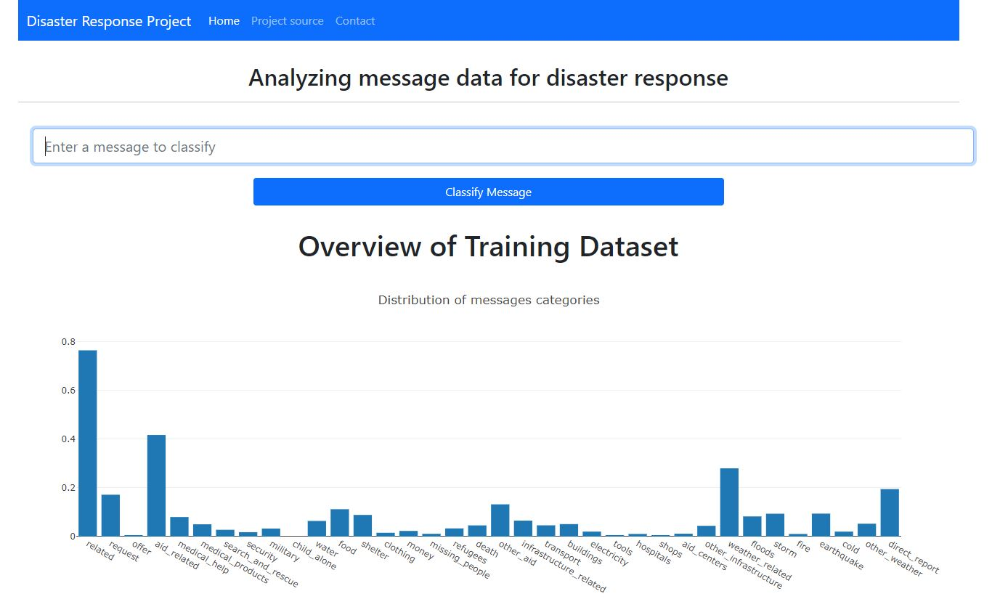
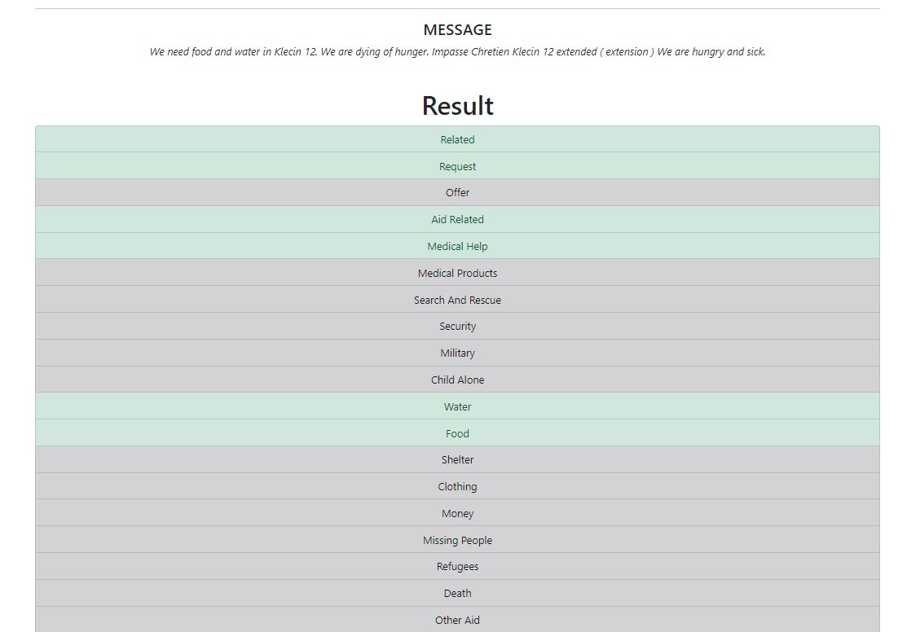

# Disaster Response Project
This project takes a dataset containing real messages that were sent during disaster events and uses a machine learning pipeline to categorize these events so that you can send the messages to an appropriate disaster relief agency.

## Motivation
Due to climate change, the number of natural disasters has largely increased. 
During such events, disaster response organisations have the least capacity to filter out relevant messages. 

This project analyses thousands of real messages sent during natural disasters, either through social media or directly to disaster response organisations.

This project aims to help disaster response professionals filter the relevant messages and classify the message category (e.g. water, medical supplies, food, etc.).

## Frameworks used
**Built with**

[Flask](https://github.com/pallets/flask)

## Installation
### Create a virtual environment 

`python -m venv <name_of_virtualenv>`
   
or using conda

`conda create --name myenv`
>Replace myenv with the environment name.

Refer to conda [documentation](https://docs.conda.io/projects/conda/en/latest/user-guide/tasks/manage-environments.html)

### Install requirements.txt
`pip install -r requirements.txt`

## How to Use?
* To run ETL pipeline

`cd data`

`python process_data.py disaster_messages.csv disaster_categories.csv <Your database name>.db`

* To run NLP and Machine Learning pipelines

`cd models`

`python train_classifier.py ../data/<Your database name>.db <Your ML model name>.pkl 0`

* To run web app on local machine

`cd app`

`python run.py`
## Screenshots

## Credits
This project is part of Udacity Data Scientist Nanodegree programme.
The dataset was provided by Appen (formerly Figure Eight)

## Licence
MIT License

Copyright (c) 2021 Yesbol Gabdullin
